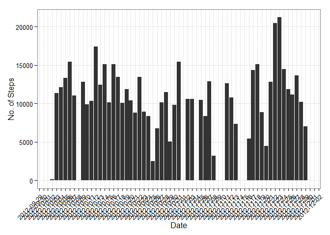
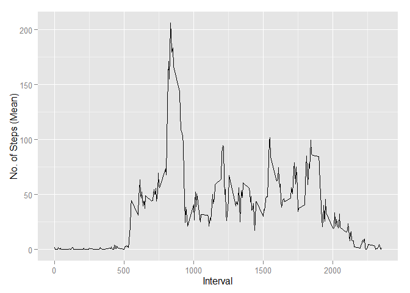
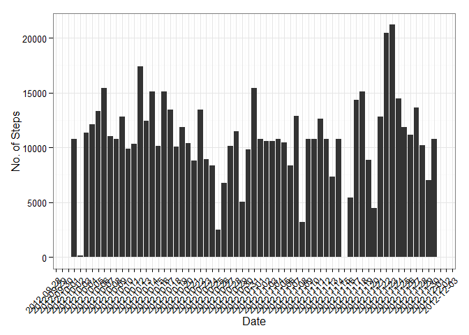
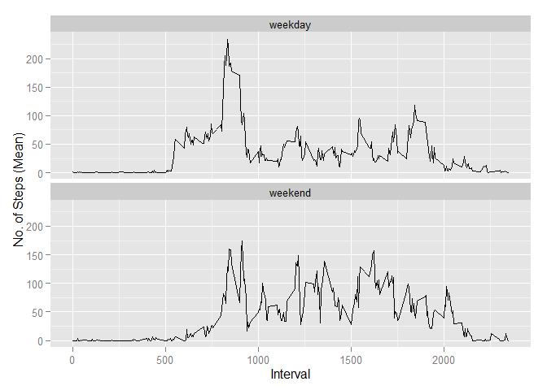

# Reproducible Research: Peer Assessment 1


## Loading and preprocessing the data

1. Load the data


```r
## load required libraries for plotting
library(ggplot2)
library("scales")

## load data from csv file. assumption is csv file 
## is in the same directory as the current working directory
activity <- read.csv("activity.csv")
```

2. Process/transform the data (if necessary) into a format suitable for your analysis


```r
## convert the columns into the respective data types
activity$date <- as.Date(activity$date)
activity$steps <- as.numeric(activity$steps)
```

## What is mean total number of steps taken per day?

1. Calculate the total number of steps taken per day

*Ans: Group steps taken by each day.*


```r
## sum steps taken by date
qn1 <- aggregate(activity$steps, by=list(activity$date), sum)

## update column names of aggregated dataset
colnames(qn1) <- c("Date", "Steps")

## convert date column to date datatype
qn1$Date <- as.Date(qn1$Date)
```

2. Make a histogram of the total number of steps taken each day

*Ans: Plot the histogram using dataset from previous step*


```r
ggplot(qn1, aes(Date, Steps)) + geom_histogram(stat="identity") + scale_x_date(breaks=date_breaks(width="1 day")) + theme_bw() + theme(axis.text.x = element_text(angle=45, hjust=1, vjust=1)) + labs(x="Date", y="No. of Steps")
```

 

3. Calculate and report the mean and median of the total number of steps taken per day

*Ans: The mean is 10766.19 and the median is 10765.*


```r
## remove na values
qn1 <- qn1[!is.na(qn1$Steps), ]
```


```r
## calculate mean
mean(qn1$Steps)
```

```
## [1] 10766.19
```

```r
## calculate median
median(qn1$Steps)
```

```
## [1] 10765
```

## What is the average daily activity pattern?

1. Make a time series plot (i.e. type = "l") of the 5-minute interval (x-axis) and the average number of steps taken, averaged across all days (y-axis)

*Ans: Remove NA values from dataset and aggregate by 5-minute interval using average steps taken*


```r
## remove na values from dataset
activity_without_na <- activity[!is.na(activity$steps), ]

## aggregate values using average for 5-minute interval
qn2 <- aggregate(activity_without_na$steps, by=list(activity_without_na$interval), mean)

## update column names of aggregated dataset
colnames(qn2) <- c("Interval", "Mean_Steps")

## plot line graph
qplot(x=Interval, y=Mean_Steps, data=qn2, geom="line", xlab="Interval", ylab="No. of Steps (Mean)")
```

 

2. Which 5-minute interval, on average across all the days in the dataset, contains the maximum number of steps?

*Ans: The 5-minute interval with maximum mean number of steps is 835*


```r
## get the interval with the most number of steps
qn2[qn2$Mean_Steps > max(qn2$Mean_Steps)-1, ]
```

```
##     Interval Mean_Steps
## 104      835   206.1698
```

## Imputing missing values

1. Calculate and report the total number of missing values in the dataset (i.e. the total number of rows with NAs)

*Ans: There are 2304 rows with missing values*


```r
length(which(is.na(activity$steps)))
```

```
## [1] 2304
```

2. Devise a strategy for filling in all of the missing values in the dataset. The strategy does not need to be sophisticated. For example, you could use the mean/median for that day, or the mean for that 5-minute interval, etc.

*Ans: Selected strategy is to use the mean of that 5-minute interval to fill up the missing values*

3. Create a new dataset that is equal to the original dataset but with the missing data filled in.

*Ans: Created a new dataset using mean of 5-minute interval to fill up missing values*


```r
## generate activity without na values
activity_without_na <- activity[!is.na(activity$steps), ]

## aggregate values using average for 5-minute interval
activity_avg_five_min <- aggregate(activity_without_na$steps, by=list(activity_without_na$interval), mean)

## merge the average of 5 minutes to the original dataset as a new dataset
activity_final <- merge(x = activity, y = activity_avg_five_min, by.x="interval", by.y="Group.1")

## create a new column called final_steps. this column will store the average steps value if the original steps is NA
activity_final$final_steps <- activity_final$steps

## for NA values, populate using the average steps
activity_final[is.na(activity_final$steps), ]$final_steps <- activity_final[is.na(activity_final$steps), ]$x
```

4. Make a histogram of the total number of steps taken each day and Calculate and report the mean and median total number of steps taken per day. Do these values differ from the estimates from the first part of the assignment? What is the impact of imputing missing data on the estimates of the total daily number of steps?

*Ans: The mean is 10766.19 and the median is 10766.19. Yes, the values are different. With the imputing of missing values, the assumption must be clear and made known as the end result may differ from the result with missing values.*


```r
## aggregate total steps taken each day
qn3 <- aggregate(activity_final$final_steps, by=list(activity_final$date), sum)

## aggregate values using average for 5-minute interval
ggplot(qn3, aes(Group.1, x)) + geom_histogram(stat="identity") + scale_x_date(breaks=date_breaks(width="1 day")) + theme_bw() + theme(axis.text.x = element_text(angle=45, hjust=1, vjust=1)) + labs(x="Date", y="No. of Steps")
```

 

```r
## calculate mean
mean(qn3$x)
```

```
## [1] 10766.19
```

```r
## calculate median
median(qn3$x)
```

```
## [1] 10766.19
```

## Are there differences in activity patterns between weekdays and weekends?

1. Create a new factor variable in the dataset with two levels - "weekday" and "weekend" indicating whether a given date is a weekday or weekend day.

*Ans: Created new dataset with a new level*


```r
## remove na values from dataset
activity_without_na <- activity[!is.na(activity$steps), ]

## create new column in dataset and set all to weekday
activity_without_na$weekday <- "weekday"

## using the date as reference, update new column to weekends where applicable
activity_without_na[weekdays(activity_without_na$date) == "Saturday" | weekdays(activity_without_na$date) == "Sunday", ]$weekday <- "weekend"
```

2. Make a panel plot containing a time series plot (i.e. type = "l") of the 5-minute interval (x-axis) and the average number of steps taken, averaged across all weekday days or weekend days (y-axis).

*Ans: See below plot*


```r
## aggregate values using average for 5-minute interval and weekday
qn4 <- aggregate(activity_without_na$steps, by=list(activity_without_na$interval, activity_without_na$weekday), mean)

## update column names of aggregated dataset
colnames(qn4) <- c("Interval", "weekday", "Mean_Steps")

## plot panel plot with line graph
ggplot(data=qn4, aes(x=Interval, y=Mean_Steps)) + geom_line() + facet_wrap( ~ weekday, ncol = 1) + labs(y="No. of Steps (Mean)")
```

 
